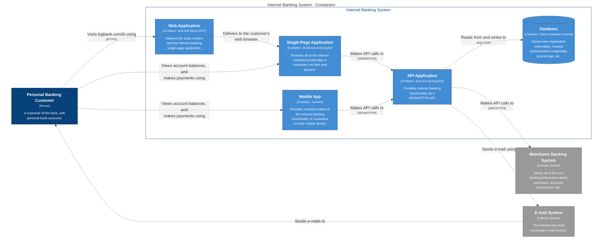
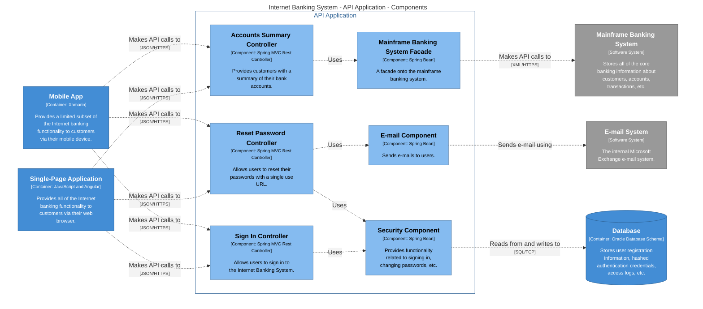
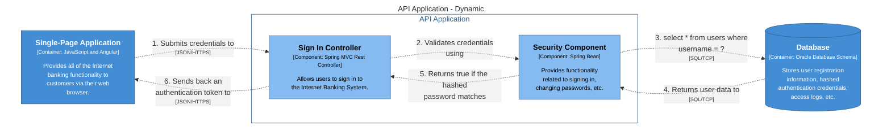

# Database

Stores user registration information, hashed authentication credentials, access logs, etc.

Technology: Oracle Database Schema

### Containers

```mermaid
graph TB
  linkStyle default fill:transparent

  subgraph diagram [Internet Banking System - Containers]
    style diagram fill:transparent,stroke:#ffffff

    1["<div style='font-weight: bold'>Personal Banking Customer</div><div style='font-size: 70%; margin-top: 0px'>[Person]</div><div style='font-size: 80%; margin-top:10px'>A customer of the bank, with<br />personal bank accounts.</div>"]
    style 1 fill:#08427b,stroke:#052e56,color:#ffffff
    4["<div style='font-weight: bold'>Mainframe Banking System</div><div style='font-size: 70%; margin-top: 0px'>[Software System]</div><div style='font-size: 80%; margin-top:10px'>Stores all of the core<br />banking information about<br />customers, accounts,<br />transactions, etc.</div>"]
    click 4 "/Big%20Bank%20plc-0/Mainframe%20Banking%20System-4" "/Big%20Bank%20plc-0/Mainframe%20Banking%20System-4"
    style 4 fill:#999999,stroke:#6b6b6b,color:#ffffff
    5["<div style='font-weight: bold'>E-mail System</div><div style='font-size: 70%; margin-top: 0px'>[Software System]</div><div style='font-size: 80%; margin-top:10px'>The internal Microsoft<br />Exchange e-mail system.</div>"]
    click 5 "/Big%20Bank%20plc-0/E-mail%20System-5" "/Big%20Bank%20plc-0/E-mail%20System-5"
    style 5 fill:#999999,stroke:#6b6b6b,color:#ffffff

    subgraph 7 [Internet Banking System]
      style 7 fill:transparent,stroke:#0b4884,color:#0b4884

      10["<div style='font-weight: bold'>Web Application</div><div style='font-size: 70%; margin-top: 0px'>[Container: Java and Spring MVC]</div><div style='font-size: 80%; margin-top:10px'>Delivers the static content<br />and the Internet banking<br />single page application.</div>"]
      click 10 "/Big%20Bank%20plc-0/Internet%20Banking%20System-7/Web%20Application-10" "/Big%20Bank%20plc-0/Internet%20Banking%20System-7/Web%20Application-10"
      style 10 fill:#438dd5,stroke:#2e6295,color:#ffffff
      11["<div style='font-weight: bold'>API Application</div><div style='font-size: 70%; margin-top: 0px'>[Container: Java and Spring MVC]</div><div style='font-size: 80%; margin-top:10px'>Provides Internet banking<br />functionality via a<br />JSON/HTTPS API.</div>"]
      click 11 "/Big%20Bank%20plc-0/Internet%20Banking%20System-7/API%20Application-11" "/Big%20Bank%20plc-0/Internet%20Banking%20System-7/API%20Application-11"
      style 11 fill:#438dd5,stroke:#2e6295,color:#ffffff
      18[("<div style='font-weight: bold'>Database</div><div style='font-size: 70%; margin-top: 0px'>[Container: Oracle Database Schema]</div><div style='font-size: 80%; margin-top:10px'>Stores user registration<br />information, hashed<br />authentication credentials,<br />access logs, etc.</div>")]
      click 18 "/Big%20Bank%20plc-0/Internet%20Banking%20System-7/Database-18" "/Big%20Bank%20plc-0/Internet%20Banking%20System-7/Database-18"
      style 18 fill:#438dd5,stroke:#2e6295,color:#ffffff
      8["<div style='font-weight: bold'>Single-Page Application</div><div style='font-size: 70%; margin-top: 0px'>[Container: JavaScript and Angular]</div><div style='font-size: 80%; margin-top:10px'>Provides all of the Internet<br />banking functionality to<br />customers via their web<br />browser.</div>"]
      click 8 "/Big%20Bank%20plc-0/Internet%20Banking%20System-7/Single-Page%20Application-8" "/Big%20Bank%20plc-0/Internet%20Banking%20System-7/Single-Page%20Application-8"
      style 8 fill:#438dd5,stroke:#2e6295,color:#ffffff
      9["<div style='font-weight: bold'>Mobile App</div><div style='font-size: 70%; margin-top: 0px'>[Container: Xamarin]</div><div style='font-size: 80%; margin-top:10px'>Provides a limited subset of<br />the Internet banking<br />functionality to customers<br />via their mobile device.</div>"]
      click 9 "/Big%20Bank%20plc-0/Internet%20Banking%20System-7/Mobile%20App-9" "/Big%20Bank%20plc-0/Internet%20Banking%20System-7/Mobile%20App-9"
      style 9 fill:#438dd5,stroke:#2e6295,color:#ffffff
    end

    5-. "<div>Sends e-mails to</div><div style='font-size: 70%'></div>" .->1
    1-. "<div>Visits bigbank.com/ib using</div><div style='font-size: 70%'>[HTTPS]</div>" .->10
    1-. "<div>Views account balances, and<br />makes payments using</div><div style='font-size: 70%'></div>" .->8
    1-. "<div>Views account balances, and<br />makes payments using</div><div style='font-size: 70%'></div>" .->9
    10-. "<div>Delivers to the customer's<br />web browser</div><div style='font-size: 70%'></div>" .->8
    8-. "<div>Makes API calls to</div><div style='font-size: 70%'>[JSON/HTTPS]</div>" .->11
    9-. "<div>Makes API calls to</div><div style='font-size: 70%'>[JSON/HTTPS]</div>" .->11
    11-. "<div>Reads from and writes to</div><div style='font-size: 70%'>[SQL/TCP]</div>" .->18
    11-. "<div>Makes API calls to</div><div style='font-size: 70%'>[XML/HTTPS]</div>" .->4
    11-. "<div>Sends e-mail using</div><div style='font-size: 70%'></div>" .->5
  end
```

### Components

```mermaid
graph TB
  linkStyle default fill:transparent

  subgraph diagram [Internet Banking System - API Application - Components]
    style diagram fill:transparent,stroke:#ffffff

    4["<div style='font-weight: bold'>Mainframe Banking System</div><div style='font-size: 70%; margin-top: 0px'>[Software System]</div><div style='font-size: 80%; margin-top:10px'>Stores all of the core<br />banking information about<br />customers, accounts,<br />transactions, etc.</div>"]
    click 4 "/Big%20Bank%20plc-0/Mainframe%20Banking%20System-4" "/Big%20Bank%20plc-0/Mainframe%20Banking%20System-4"
    style 4 fill:#999999,stroke:#6b6b6b,color:#ffffff
    5["<div style='font-weight: bold'>E-mail System</div><div style='font-size: 70%; margin-top: 0px'>[Software System]</div><div style='font-size: 80%; margin-top:10px'>The internal Microsoft<br />Exchange e-mail system.</div>"]
    click 5 "/Big%20Bank%20plc-0/E-mail%20System-5" "/Big%20Bank%20plc-0/E-mail%20System-5"
    style 5 fill:#999999,stroke:#6b6b6b,color:#ffffff
    18[("<div style='font-weight: bold'>Database</div><div style='font-size: 70%; margin-top: 0px'>[Container: Oracle Database Schema]</div><div style='font-size: 80%; margin-top:10px'>Stores user registration<br />information, hashed<br />authentication credentials,<br />access logs, etc.</div>")]
    click 18 "/Big%20Bank%20plc-0/Internet%20Banking%20System-7/Database-18" "/Big%20Bank%20plc-0/Internet%20Banking%20System-7/Database-18"
    style 18 fill:#438dd5,stroke:#2e6295,color:#ffffff
    8["<div style='font-weight: bold'>Single-Page Application</div><div style='font-size: 70%; margin-top: 0px'>[Container: JavaScript and Angular]</div><div style='font-size: 80%; margin-top:10px'>Provides all of the Internet<br />banking functionality to<br />customers via their web<br />browser.</div>"]
    click 8 "/Big%20Bank%20plc-0/Internet%20Banking%20System-7/Single-Page%20Application-8" "/Big%20Bank%20plc-0/Internet%20Banking%20System-7/Single-Page%20Application-8"
    style 8 fill:#438dd5,stroke:#2e6295,color:#ffffff
    9["<div style='font-weight: bold'>Mobile App</div><div style='font-size: 70%; margin-top: 0px'>[Container: Xamarin]</div><div style='font-size: 80%; margin-top:10px'>Provides a limited subset of<br />the Internet banking<br />functionality to customers<br />via their mobile device.</div>"]
    click 9 "/Big%20Bank%20plc-0/Internet%20Banking%20System-7/Mobile%20App-9" "/Big%20Bank%20plc-0/Internet%20Banking%20System-7/Mobile%20App-9"
    style 9 fill:#438dd5,stroke:#2e6295,color:#ffffff

    subgraph 11 [API Application]
      style 11 fill:transparent,stroke:#2e6295,color:#2e6295

      12["<div style='font-weight: bold'>Sign In Controller</div><div style='font-size: 70%; margin-top: 0px'>[Component: Spring MVC Rest Controller]</div><div style='font-size: 80%; margin-top:10px'>Allows users to sign in to<br />the Internet Banking System.</div>"]
      click 12 "/Big%20Bank%20plc-0/Internet%20Banking%20System-7/API%20Application-11/Sign%20In%20Controller-12" "/Big%20Bank%20plc-0/Internet%20Banking%20System-7/API%20Application-11/Sign%20In%20Controller-12"
      style 12 fill:#85bbf0,stroke:#5d82a8,color:#000000
      13["<div style='font-weight: bold'>Accounts Summary Controller</div><div style='font-size: 70%; margin-top: 0px'>[Component: Spring MVC Rest Controller]</div><div style='font-size: 80%; margin-top:10px'>Provides customers with a<br />summary of their bank<br />accounts.</div>"]
      click 13 "/Big%20Bank%20plc-0/Internet%20Banking%20System-7/API%20Application-11/Accounts%20Summary%20Controller-13" "/Big%20Bank%20plc-0/Internet%20Banking%20System-7/API%20Application-11/Accounts%20Summary%20Controller-13"
      style 13 fill:#85bbf0,stroke:#5d82a8,color:#000000
      14["<div style='font-weight: bold'>Reset Password Controller</div><div style='font-size: 70%; margin-top: 0px'>[Component: Spring MVC Rest Controller]</div><div style='font-size: 80%; margin-top:10px'>Allows users to reset their<br />passwords with a single use<br />URL.</div>"]
      click 14 "/Big%20Bank%20plc-0/Internet%20Banking%20System-7/API%20Application-11/Reset%20Password%20Controller-14" "/Big%20Bank%20plc-0/Internet%20Banking%20System-7/API%20Application-11/Reset%20Password%20Controller-14"
      style 14 fill:#85bbf0,stroke:#5d82a8,color:#000000
      15["<div style='font-weight: bold'>Security Component</div><div style='font-size: 70%; margin-top: 0px'>[Component: Spring Bean]</div><div style='font-size: 80%; margin-top:10px'>Provides functionality<br />related to signing in,<br />changing passwords, etc.</div>"]
      click 15 "/Big%20Bank%20plc-0/Internet%20Banking%20System-7/API%20Application-11/Security%20Component-15" "/Big%20Bank%20plc-0/Internet%20Banking%20System-7/API%20Application-11/Security%20Component-15"
      style 15 fill:#85bbf0,stroke:#5d82a8,color:#000000
      16["<div style='font-weight: bold'>Mainframe Banking System Facade</div><div style='font-size: 70%; margin-top: 0px'>[Component: Spring Bean]</div><div style='font-size: 80%; margin-top:10px'>A facade onto the mainframe<br />banking system.</div>"]
      click 16 "/Big%20Bank%20plc-0/Internet%20Banking%20System-7/API%20Application-11/Mainframe%20Banking%20System%20Facade-16" "/Big%20Bank%20plc-0/Internet%20Banking%20System-7/API%20Application-11/Mainframe%20Banking%20System%20Facade-16"
      style 16 fill:#85bbf0,stroke:#5d82a8,color:#000000
      17["<div style='font-weight: bold'>E-mail Component</div><div style='font-size: 70%; margin-top: 0px'>[Component: Spring Bean]</div><div style='font-size: 80%; margin-top:10px'>Sends e-mails to users.</div>"]
      click 17 "/Big%20Bank%20plc-0/Internet%20Banking%20System-7/API%20Application-11/E-mail%20Component-17" "/Big%20Bank%20plc-0/Internet%20Banking%20System-7/API%20Application-11/E-mail%20Component-17"
      style 17 fill:#85bbf0,stroke:#5d82a8,color:#000000
    end

    8-. "<div>Makes API calls to</div><div style='font-size: 70%'>[JSON/HTTPS]</div>" .->12
    8-. "<div>Makes API calls to</div><div style='font-size: 70%'>[JSON/HTTPS]</div>" .->13
    8-. "<div>Makes API calls to</div><div style='font-size: 70%'>[JSON/HTTPS]</div>" .->14
    9-. "<div>Makes API calls to</div><div style='font-size: 70%'>[JSON/HTTPS]</div>" .->12
    9-. "<div>Makes API calls to</div><div style='font-size: 70%'>[JSON/HTTPS]</div>" .->13
    9-. "<div>Makes API calls to</div><div style='font-size: 70%'>[JSON/HTTPS]</div>" .->14
    12-. "<div>Uses</div><div style='font-size: 70%'></div>" .->15
    13-. "<div>Uses</div><div style='font-size: 70%'></div>" .->16
    14-. "<div>Uses</div><div style='font-size: 70%'></div>" .->15
    14-. "<div>Uses</div><div style='font-size: 70%'></div>" .->17
    15-. "<div>Reads from and writes to</div><div style='font-size: 70%'>[SQL/TCP]</div>" .->18
    16-. "<div>Makes API calls to</div><div style='font-size: 70%'>[XML/HTTPS]</div>" .->4
    17-. "<div>Sends e-mail using</div><div style='font-size: 70%'></div>" .->5
  end
```

### SignIn

```mermaid
graph TB
  linkStyle default fill:transparent

  subgraph diagram [API Application - Dynamic]
    style diagram fill:transparent,stroke:#ffffff

    subgraph 11 [API Application]
      style 11 fill:transparent,stroke:#2e6295,color:#2e6295

      12["<div style='font-weight: bold'>Sign In Controller</div><div style='font-size: 70%; margin-top: 0px'>[Component: Spring MVC Rest Controller]</div><div style='font-size: 80%; margin-top:10px'>Allows users to sign in to<br />the Internet Banking System.</div>"]
      click 12 "/Big%20Bank%20plc-0/Internet%20Banking%20System-7/API%20Application-11/Sign%20In%20Controller-12" "/Big%20Bank%20plc-0/Internet%20Banking%20System-7/API%20Application-11/Sign%20In%20Controller-12"
      style 12 fill:#85bbf0,stroke:#5d82a8,color:#000000
      15["<div style='font-weight: bold'>Security Component</div><div style='font-size: 70%; margin-top: 0px'>[Component: Spring Bean]</div><div style='font-size: 80%; margin-top:10px'>Provides functionality<br />related to signing in,<br />changing passwords, etc.</div>"]
      click 15 "/Big%20Bank%20plc-0/Internet%20Banking%20System-7/API%20Application-11/Security%20Component-15" "/Big%20Bank%20plc-0/Internet%20Banking%20System-7/API%20Application-11/Security%20Component-15"
      style 15 fill:#85bbf0,stroke:#5d82a8,color:#000000
    end

    18[("<div style='font-weight: bold'>Database</div><div style='font-size: 70%; margin-top: 0px'>[Container: Oracle Database Schema]</div><div style='font-size: 80%; margin-top:10px'>Stores user registration<br />information, hashed<br />authentication credentials,<br />access logs, etc.</div>")]
    click 18 "/Big%20Bank%20plc-0/Internet%20Banking%20System-7/Database-18" "/Big%20Bank%20plc-0/Internet%20Banking%20System-7/Database-18"
    style 18 fill:#438dd5,stroke:#2e6295,color:#ffffff
    8["<div style='font-weight: bold'>Single-Page Application</div><div style='font-size: 70%; margin-top: 0px'>[Container: JavaScript and Angular]</div><div style='font-size: 80%; margin-top:10px'>Provides all of the Internet<br />banking functionality to<br />customers via their web<br />browser.</div>"]
    click 8 "/Big%20Bank%20plc-0/Internet%20Banking%20System-7/Single-Page%20Application-8" "/Big%20Bank%20plc-0/Internet%20Banking%20System-7/Single-Page%20Application-8"
    style 8 fill:#438dd5,stroke:#2e6295,color:#ffffff

    8-. "<div>1. Submits credentials to</div><div style='font-size: 70%'>[JSON/HTTPS]</div>" .->12
    12-. "<div>2. Validates credentials<br />using</div><div style='font-size: 70%'></div>" .->15
    15-. "<div>3. select * from users where<br />username = ?</div><div style='font-size: 70%'>[SQL/TCP]</div>" .->18
    18-. "<div>4. Returns user data to</div><div style='font-size: 70%'>[SQL/TCP]</div>" .->15
    15-. "<div>5. Returns true if the hashed<br />password matches</div><div style='font-size: 70%'></div>" .->12
    12-. "<div>6. Sends back an<br />authentication token to</div><div style='font-size: 70%'>[JSON/HTTPS]</div>" .->8
  end
```

