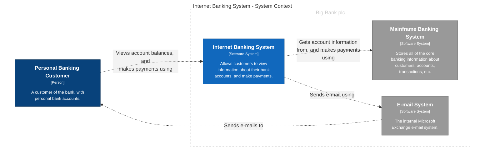
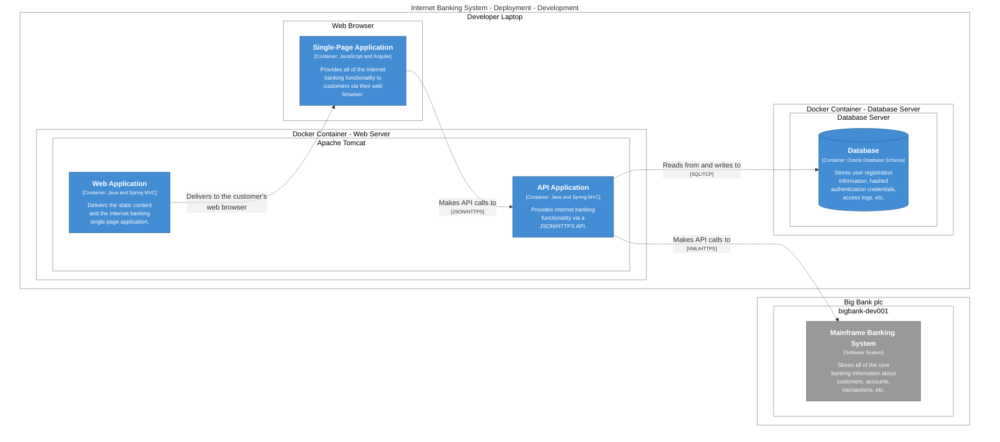
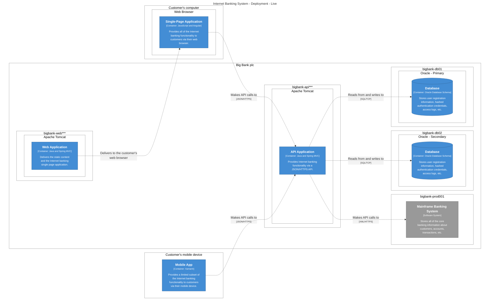

# Internet Banking System

Allows customers to view information about their bank accounts, and make payments.

Containers:
- [API Application](./API%20Application-11/)
- [Database](./Database-18/)
- [Mobile App](./Mobile%20App-9/)
- [Single-Page Application](./Single-Page%20Application-8/)
- [Web Application](./Web%20Application-10/)
### SystemContext

## Deployment - Development
### DevelopmentDeployment

## Deployment - Live
### LiveDeployment

