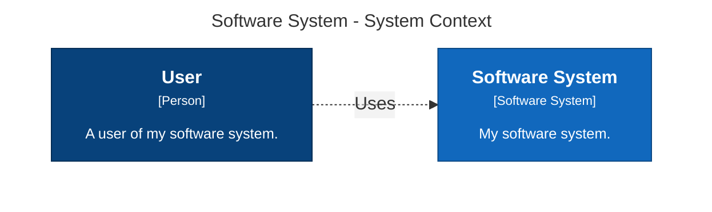

# Software System

My software system.

### SystemContext

```mermaid
graph TB
  linkStyle default fill:transparent

  subgraph diagram [Software System - System Context]
    style diagram fill:transparent,stroke:#ffffff

    1["<div style='font-weight: bold'>User</div><div style='font-size: 70%; margin-top: 0px'>[Person]</div><div style='font-size: 80%; margin-top:10px'>A user of my software system.</div>"]
    style 1 fill:#08427b,stroke:#052e56,color:#ffffff
    2["<div style='font-weight: bold'>Software System</div><div style='font-size: 70%; margin-top: 0px'>[Software System]</div><div style='font-size: 80%; margin-top:10px'>My software system.</div>"]
    click 2 "/Getting%20Started-0/Software%20System-2" "/Getting%20Started-0/Software%20System-2"
    style 2 fill:#1168bd,stroke:#0b4884,color:#ffffff

    1-. "<div>Uses</div><div style='font-size: 70%'></div>" .->2
  end
```

