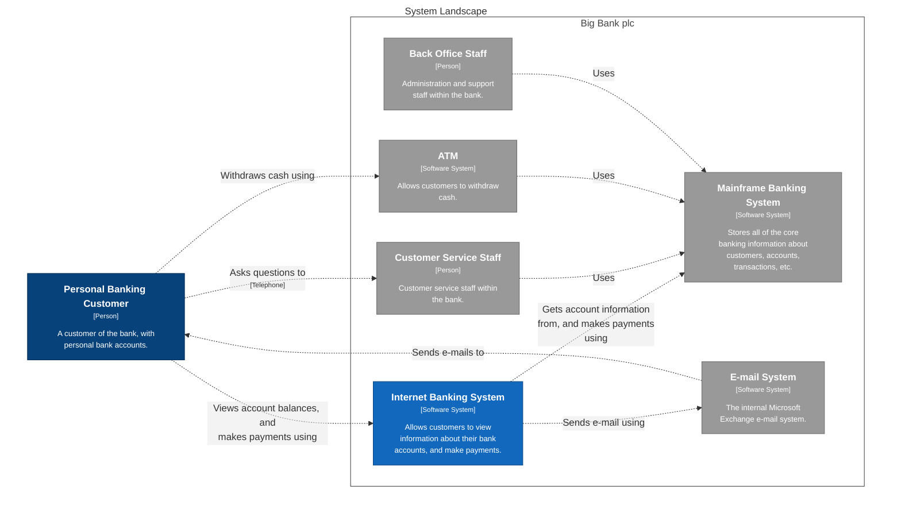

# Big Bank plc

This is an example workspace to illustrate the key features of Structurizr, via the DSL, based around a fictional online banking system.

Systems:

- [ATM](./ATM-6/)
- [E-mail System](./E-mail%20System-5/)
- [Internet Banking System](./Internet%20Banking%20System-7/)
- [Mainframe Banking System](./Mainframe%20Banking%20System-4/)

### SystemLandscape

