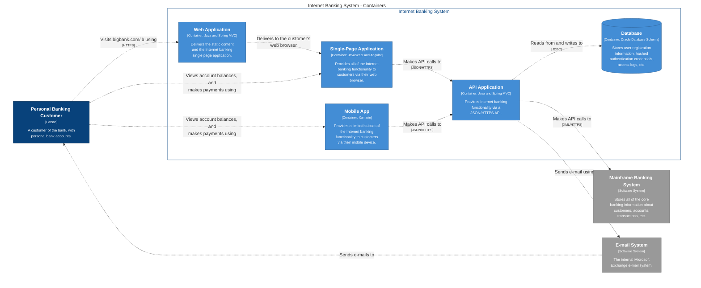

# Web Application

Delivers the static content and the Internet banking single page application.

Technology: Java and Spring MVC

### Containers

```mermaid
graph TB
  linkStyle default fill:transparent

  subgraph diagram [Internet Banking System - Containers]
    style diagram fill:transparent,stroke:#ffffff

    1["<div style='font-weight: bold'>Personal Banking Customer</div><div style='font-size: 70%; margin-top: 0px'>[Person]</div><div style='font-size: 80%; margin-top:10px'>A customer of the bank, with<br />personal bank accounts.</div>"]
    style 1 fill:#08427b,stroke:#052e56,color:#ffffff
    4["<div style='font-weight: bold'>Mainframe Banking System</div><div style='font-size: 70%; margin-top: 0px'>[Software System]</div><div style='font-size: 80%; margin-top:10px'>Stores all of the core<br />banking information about<br />customers, accounts,<br />transactions, etc.</div>"]
    click 4 "../../Mainframe%20Banking%20System-4/" "Mainframe%20Banking%20System-4/"
    style 4 fill:#999999,stroke:#6b6b6b,color:#ffffff
    5["<div style='font-weight: bold'>E-mail System</div><div style='font-size: 70%; margin-top: 0px'>[Software System]</div><div style='font-size: 80%; margin-top:10px'>The internal Microsoft<br />Exchange e-mail system.</div>"]
    click 5 "../../E-mail%20System-5/" "E-mail%20System-5/"
    style 5 fill:#999999,stroke:#6b6b6b,color:#ffffff

    subgraph 7 [Internet Banking System]
      style 7 fill:transparent,stroke:#0b4884,color:#0b4884

      10["<div style='font-weight: bold'>Web Application</div><div style='font-size: 70%; margin-top: 0px'>[Container: Java and Spring MVC]</div><div style='font-size: 80%; margin-top:10px'>Delivers the static content<br />and the Internet banking<br />single page application.</div>"]
      click 10 "../../Internet%20Banking%20System-7/Web%20Application-10/" "Internet%20Banking%20System-7/Web%20Application-10/"
      style 10 fill:#438dd5,stroke:#2e6295,color:#ffffff
      11["<div style='font-weight: bold'>API Application</div><div style='font-size: 70%; margin-top: 0px'>[Container: Java and Spring MVC]</div><div style='font-size: 80%; margin-top:10px'>Provides Internet banking<br />functionality via a<br />JSON/HTTPS API.</div>"]
      click 11 "../../Internet%20Banking%20System-7/API%20Application-11/" "Internet%20Banking%20System-7/API%20Application-11/"
      style 11 fill:#438dd5,stroke:#2e6295,color:#ffffff
      18[("<div style='font-weight: bold'>Database</div><div style='font-size: 70%; margin-top: 0px'>[Container: Oracle Database Schema]</div><div style='font-size: 80%; margin-top:10px'>Stores user registration<br />information, hashed<br />authentication credentials,<br />access logs, etc.</div>")]
      click 18 "../../Internet%20Banking%20System-7/Database-18/" "Internet%20Banking%20System-7/Database-18/"
      style 18 fill:#438dd5,stroke:#2e6295,color:#ffffff
      8["<div style='font-weight: bold'>Single-Page Application</div><div style='font-size: 70%; margin-top: 0px'>[Container: JavaScript and Angular]</div><div style='font-size: 80%; margin-top:10px'>Provides all of the Internet<br />banking functionality to<br />customers via their web<br />browser.</div>"]
      click 8 "../../Internet%20Banking%20System-7/Single-Page%20Application-8/" "Internet%20Banking%20System-7/Single-Page%20Application-8/"
      style 8 fill:#438dd5,stroke:#2e6295,color:#ffffff
      9["<div style='font-weight: bold'>Mobile App</div><div style='font-size: 70%; margin-top: 0px'>[Container: Xamarin]</div><div style='font-size: 80%; margin-top:10px'>Provides a limited subset of<br />the Internet banking<br />functionality to customers<br />via their mobile device.</div>"]
      click 9 "../../Internet%20Banking%20System-7/Mobile%20App-9/" "Internet%20Banking%20System-7/Mobile%20App-9/"
      style 9 fill:#438dd5,stroke:#2e6295,color:#ffffff
    end

    5-. "<div>Sends e-mails to</div><div style='font-size: 70%'></div>" .->1
    1-. "<div>Visits bigbank.com/ib using</div><div style='font-size: 70%'>[HTTPS]</div>" .->10
    1-. "<div>Views account balances, and<br />makes payments using</div><div style='font-size: 70%'></div>" .->8
    1-. "<div>Views account balances, and<br />makes payments using</div><div style='font-size: 70%'></div>" .->9
    10-. "<div>Delivers to the customer's<br />web browser</div><div style='font-size: 70%'></div>" .->8
    8-. "<div>Makes API calls to</div><div style='font-size: 70%'>[JSON/HTTPS]</div>" .->11
    9-. "<div>Makes API calls to</div><div style='font-size: 70%'>[JSON/HTTPS]</div>" .->11
    11-. "<div>Reads from and writes to</div><div style='font-size: 70%'>[JDBC]</div>" .->18
    11-. "<div>Makes API calls to</div><div style='font-size: 70%'>[XML/HTTPS]</div>" .->4
    11-. "<div>Sends e-mail using</div><div style='font-size: 70%'></div>" .->5
  end
```

