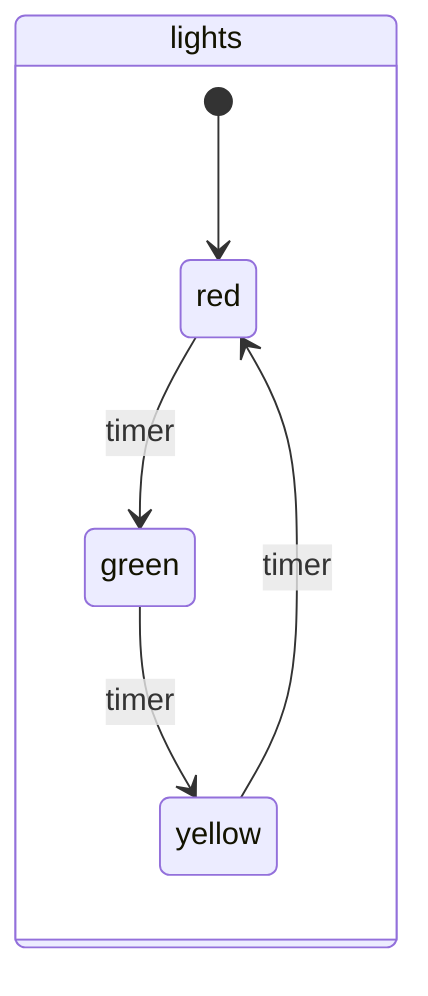
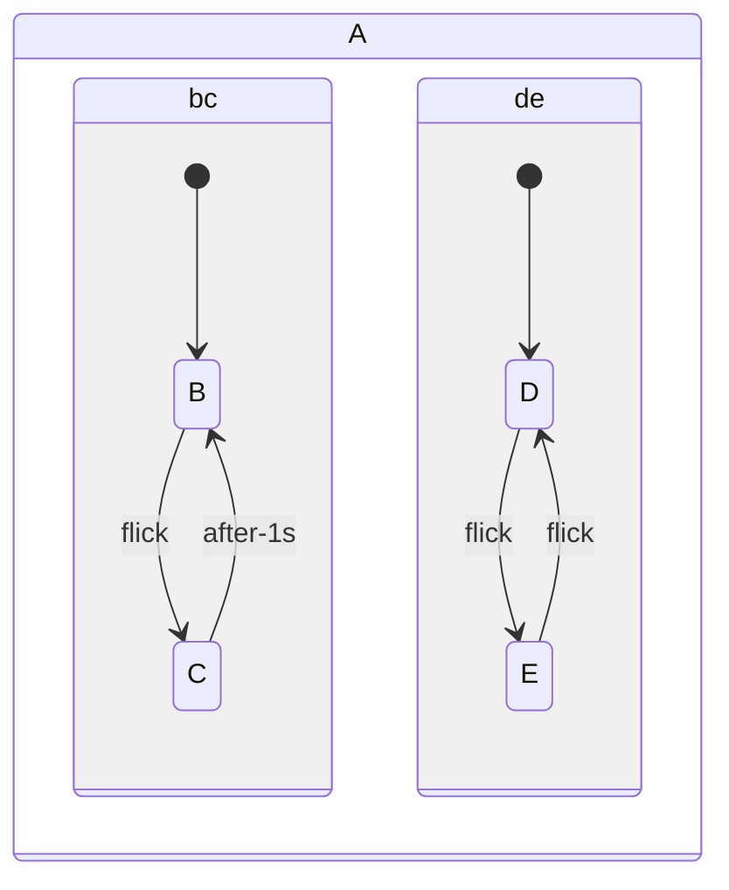

## machine

[source](https://github.com/dundalek/dinodoc/blob/main/example/statecharts.clj#L9-L9)

## regions

[source](https://github.com/dundalek/dinodoc/blob/main/example/statecharts.clj#L25-L25)
