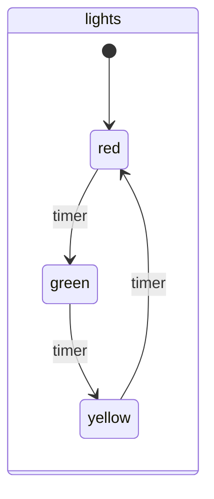
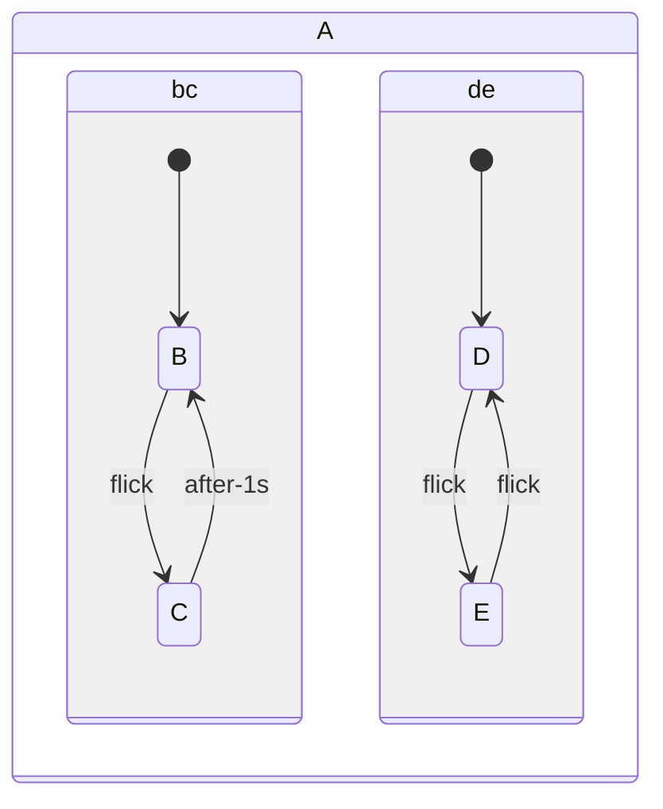
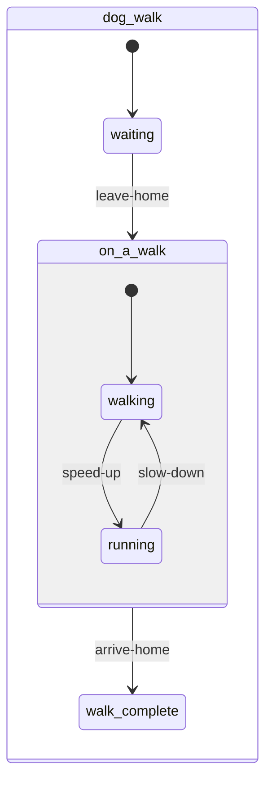

## machine

An example of a simple lights machine.  
Based on https://lucywang000.github.io/clj-statecharts/docs/actions/#a-full-example

[source](https://github.com/dundalek/dinodoc/blob/main/example/statecharts.clj#L8-L8)

## regions

Example of parallel regions.  
Based on https://statecharts.dev/what-is-a-statechart.html#a-state-can-have-many-regions

[source](https://github.com/dundalek/dinodoc/blob/main/example/statecharts.clj#L41-L41)

## dog-walk

Demonstrating nested states.  
Based on https://stately.ai/docs/state-machines-and-statecharts#parent-states

